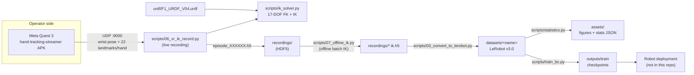
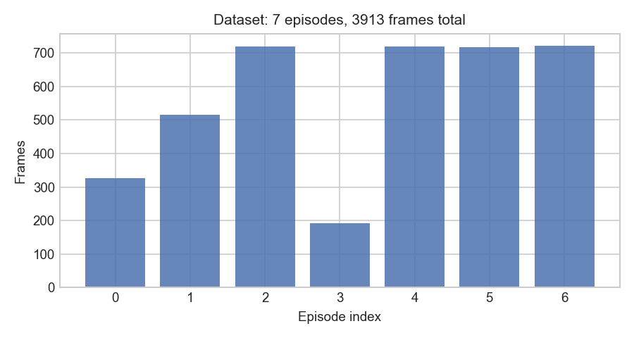
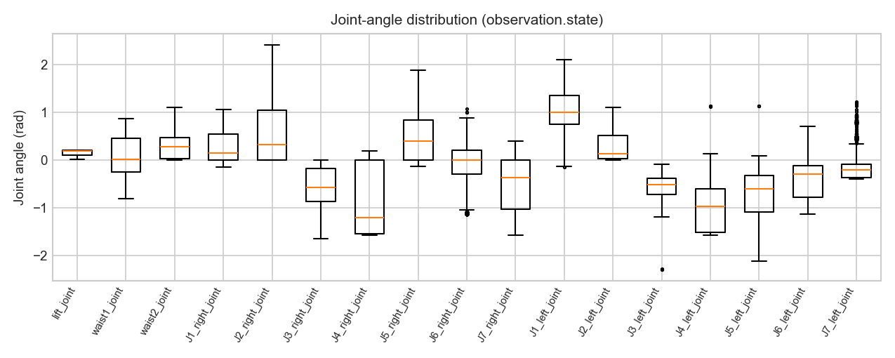
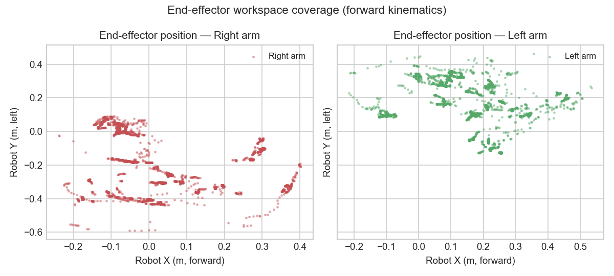
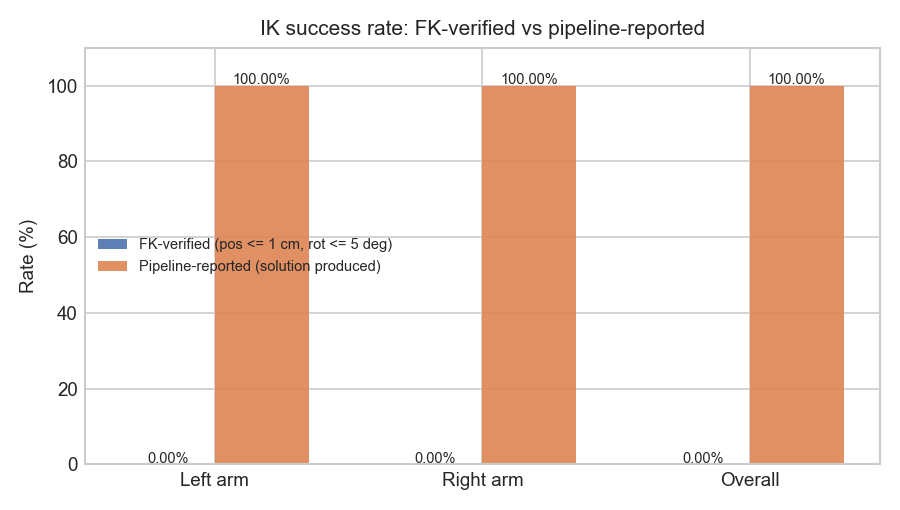
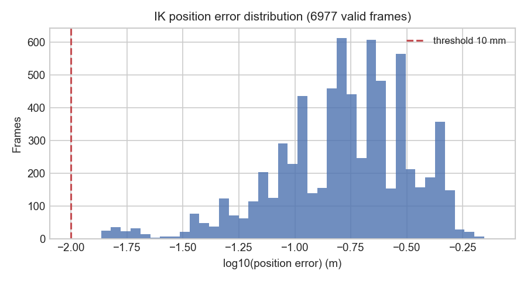

# F1 VR Teleoperation Pipeline for Imitation Learning

**VR hand tracking → whole-body inverse kinematics → LeRobot-format datasets → behavior cloning training.**

An end-to-end, reproducible pipeline for collecting robot manipulation
demonstrations with a Meta Quest 3 headset, solving dual-arm inverse
kinematics for a 17-DOF humanoid-torso mobile manipulator, and exporting
Hugging Face [LeRobot](https://github.com/huggingface/lerobot)-format
datasets ready for behavior-cloning (BC) training.

## Overview

Recent vision-language-action (VLA) models make robot learning dependent on
high-quality, task-annotated demonstration data. Collecting such data
requires (1) an intuitive teleoperation interface, (2) a reliable solver
that maps operator hand poses to robot joint targets, and (3) a dataset
format accepted by downstream training stacks. This repository provides all
three:

| Component | What it does |
|-----------|--------------|
| `scripts/06_vr_ik_record.py` | Receives Quest 3 hand-tracking streams over UDP, solves IK per frame, records HDF5 + LeRobot output |
| `scripts/ik_solver.py` | Parses the robot URDF, builds kinematic chains, solves IK with scipy L-BFGS-B (pure NumPy/SciPy, no ROS dependency) |
| `scripts/07_offline_ik.py` | Batch IK for previously recorded hand data |
| `scripts/03_convert_to_lerobot.py` | Converts HDF5 episodes into LeRobot v3.0 datasets (Parquet + metadata) |
| `scripts/statistics.py` | Dataset statistics and IK verification figures for publications |
| `scripts/train_bc.py` | One-command behavior cloning training with LeRobot |

**Key results (current dataset `f1_vr_v2`):**

- 7 episodes, **3,913 frames** at 30 FPS, 17-DOF state/action vectors
- IK solution produced for **99.9%** of tracked hand frames
  (6,977 / 6,983); see [IK success metrics](#ik-success-metrics) for the
  full definition
- Dataset exports load directly with `LeRobotDataset`

> ⚠️ **Calibration note.** The hand→robot mapping (scale/offset) is currently
> a provisional visual estimate. Strict FK-based re-verification of the
> recorded joint targets (position error ≤ 1 cm, orientation error ≤ 5°)
> therefore does **not** yet pass on the current data, and the mapping must
> be physically calibrated before accuracy numbers are reported. See
> [docs/data_collection_pipeline.md](docs/data_collection_pipeline.md) and
> [IK success metrics](#ik-success-metrics). This is the main open item for
> the paper.

## System Architecture



## Repository Structure

```
├── README.md                  # this file
├── requirements.txt           # Python dependencies (Ubuntu 22.04 + RTX 4090)
├── LICENSE                    # MIT
├── scripts/
│   ├── ik_solver.py           # URDF parsing, FK, L-BFGS-B IK (core library)
│   ├── 01_test_environment.py # dependency self-check
│   ├── 02_record_episode.py   # episode recorder with simulated data demo
│   ├── 03_convert_to_lerobot.py # HDF5 → LeRobot v3.0 conversion
│   ├── 04_vr_hand_record.py   # Quest 3 UDP recording (hand-tracking-sdk)
│   ├── 05_quick_record.py     # raw UDP quick recording
│   ├── 06_vr_ik_record.py     # live: UDP → IK → HDF5 + LeRobot
│   ├── 07_offline_ik.py       # offline batch IK for recorded HDF5
│   ├── pico_sniffer.py        # UDP format sniffing for new devices
│   ├── statistics.py          # dataset statistics + IK verification (new)
│   └── train_bc.py            # BC training wrapper (new)
├── configs/
│   └── train_bc.yaml          # BC hyperparameters (new)
├── docs/
│   ├── data_collection_pipeline.md # hardware, workflow, IK method (new)
│   ├── lerobot_data_format.md      # LeRobot v3.0 format reference (new)
│   ├── paper_draft_notes.md        # paper writing aid (new)
│   └── paper_outline.md            # 7-section paper outline (new)
├── urdf/                      # F1 URDF, meshes, joint config
├── assets/                    # figures, demo video placeholder (new)
├── data/                      # reserved for linked/copied data (new)
├── recordings/                # raw HDF5 episodes (git-ignored)
└── datasets/                  # LeRobot datasets (git-ignored)
```

## Installation

Tested target environment: **Ubuntu 22.04 + RTX 4090** (also runs on
Windows for data collection; see note below).

### 1. System dependencies

- Python 3.10
- NVIDIA driver + CUDA 12.x (required only for training)
- [ADB](https://developer.android.com/tools/adb) (optional; only for
  sideloading the Quest 3 APK)

### 2. Python environment

```bash
conda create -n f1-teleop python=3.10 -y
conda activate f1-teleop
pip install -r requirements.txt
```

Verify the environment:

```bash
python scripts/01_test_environment.py
# expect: "Environment check complete."
```

> **Windows note.** The data-collection scripts run on Windows as well
> (see `activate.bat` / `activate.sh`); only the training step requires the
> Linux GPU machine.

## Quick Start

### 0. Sanity check

```bash
python scripts/01_test_environment.py
python scripts/statistics.py --demo          # preview figures in assets/
```

### 1. Record an episode (demo mode, no hardware)

`scripts/02_record_episode.py` records a simulated trajectory:

```bash
python scripts/02_record_episode.py --episode-name demo --duration 5 --output ./recordings
```

### 2. Record with VR hand tracking (hardware required)

1. On the Quest 3: start the hand-tracking-streamer APK and point it at the
   PC's LAN IP, UDP port 9000 (see
   [docs/data_collection_pipeline.md](docs/data_collection_pipeline.md)).
2. On the PC:

```bash
python scripts/06_vr_ik_record.py --duration 30 --fps 30 \
    --output ./recordings --dataset f1_vr_v2 --task "pick up the cube"
```

This records HDF5 and exports a LeRobot dataset in one pass.

### 3. Convert recorded HDF5 to LeRobot format

```bash
python scripts/03_convert_to_lerobot.py --input ./recordings --output ./datasets/f1_vr_v2
```

### 4. Dataset statistics and IK verification

```bash
python scripts/statistics.py \
    --dataset ./datasets/f1_vr_v2 \
    --ik-h5 "./recordings/episode_*.ik.h5" \
    --assets ./assets
```

### 5. Train a behavior cloning policy

```bash
# edit dataset.repo_id in configs/train_bc.yaml first
python scripts/train_bc.py --config configs/train_bc.yaml
```

This launches LeRobot's `lerobot-train` with the hyperparameters in
[configs/train_bc.yaml](configs/train_bc.yaml). Checkpoints are written to
`outputs/train/`.

## Data Format

Datasets follow **LeRobot v3.0** layout:

```
datasets/<name>/
├── meta/
│   ├── info.json        # features dictionary, fps, episode/frame counts
│   ├── episodes.jsonl   # per-episode task labels and lengths
│   ├── tasks.jsonl      # task descriptions
│   └── modality.json    # state/action segment names (for VLA models)
└── data/
    └── chunk-000/
        └── episode_000000.parquet   # or file-000.parquet
```

Required Parquet columns and feature shapes:

| Column | dtype | shape | description |
|--------|-------|-------|-------------|
| `observation.state` | float32 | [17] | current joint angles: 3 torso (lift, waist1, waist2) + 7 right arm (J1_R..J7_R) + 7 left arm (J1_L..J7_L) |
| `action` | float32 | [17] | target joint angles (IK output; same layout) |
| `timestamp` | float32 | [1] | seconds within episode |
| `episode_index` | int64 | [1] | episode id |
| `index` | int64 | [1] | global frame id |
| `task_index` | int64 | [1] | task id |
| `next.done` | bool | [1] | last frame of episode |
| `next.reward` | float32 | [1] | 1.0 on success |

Raw HDF5 episodes additionally store `observation.left_hand.wrist_pose`
(7: xyz + qxyzw), `observation.left_hand.landmarks` (66 = 22 joints × 3),
and the same for the right hand. See
[docs/lerobot_data_format.md](docs/lerobot_data_format.md) for details on
the format, the four internal transforms used by VLA training stacks, and
normalization statistics.

## Experimental Results

### Dataset statistics (f1_vr_v2)

| Metric | Value |
|--------|-------|
| Episodes | 7 |
| Total frames | 3,913 |
| FPS | 30 |
| Frames per episode | 327 / 516 / 720 / 192 / 719 / 717 / 722 |
| State / action dims | 17 (3 torso + 7 right + 7 left) |
| Task | pick up the cube |





*(Regenerate: `python scripts/statistics.py --dataset ./datasets/f1_vr_v2 --assets ./assets`)*

### IK success metrics

Two complementary metrics are reported:

1. **Pipeline-reported solve rate** — the fraction of tracked hand frames
   for which the recording pipeline produced a joint solution
   (`ik_*_solved` attributes in `*.ik.h5`). Current value: **99.9%
   (6,977 / 6,983)**, i.e. 100% of tracked frames.
2. **FK-verified accuracy** — recomputed by `scripts/statistics.py`: run
   forward kinematics on the stored joint angles and compare against the
   hand-pose target. A frame passes if position error ≤ 1 cm and
   orientation error ≤ 5°. **Current status: pending** — with the
   provisional (uncalibrated) hand→robot mapping, FK errors are
   systematically larger than the thresholds (see figure below). The
   mapping must be physically calibrated (or a learned mapping fitted)
   before accuracy claims are made. This is tracked as the main
   experimental TODO in
   [docs/paper_draft_notes.md](docs/paper_draft_notes.md).




### Reproducing the numbers

```bash
python scripts/statistics.py \
    --dataset ./datasets/f1_vr_v2 \
    --ik-h5 "./recordings/episode_*.ik.h5" \
    --assets ./assets
cat assets/dataset_stats.json
```

## Citation

If you use this pipeline or dataset in your research, please cite:

```bibtex
@misc{f1_teleop_pipeline,
  title        = {F1 VR Teleoperation Pipeline for Imitation Learning},
  author       = {F1 Teleop Pipeline Contributors},
  year         = {2026},
  howpublished = {\url{https://github.com/hua0467/f1-teleop-pipeline}},
  note         = {Code and dataset. Publication in preparation.}
}
```

## Demo Video

**Coming soon.** A full teleoperation session video will be placed at
[`assets/demo_video.mp4`](assets/demo_video.mp4)
(placeholder tracked in `assets/`).

## License

This project is licensed under the MIT License — see [LICENSE](LICENSE).

The robot URDF and mesh files in [`urdf/`](urdf/) are redistributed as-is
for research reproducibility.
